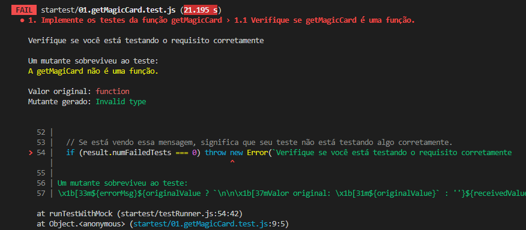

<details>
  <summary><strong>🛠 Testes</strong></summary><br />

  Neste exercício você desenvolverá os testes para funções assíncronas. Mas então, como o exercício será avaliado?

  ### Quem testa os testes?

  O avaliador automatizado **testará os testes de vocês!** A ideia dele é a seguinte: você vai escrever casos de teste para a aplicação, certo? E esses testes têm que garantir que a aplicação está funcionando, certo? Pois bem! Se eu quebro uma parte da aplicação, fazendo uma alteração no código, seus testes devem quebrar, certo? Pois é isso que o avaliador faz!

  Mas como assim? :thinking: 
  
  Pense da seguinte forma: nosso avaliador vai fazer várias mudanças no código original **para que ela quebre e pare de funcionar**. Em seguida ele vai rodar seus testes. Caso seus testes não acusem que a aplicação está com problemas, o avaliador não vai aprovar aquele requisito! Se, para todas as alterações que o avaliador fizer no código da aplicação, os seus testes acusarem problemas, tudo será aprovado! O avaliador garante, portanto, que seus testes, de fato, testam a aplicação como se deve.
  
  Na linguagem do avaliador, dizemos que cada mudança que o avaliador faz na sua aplicação é um **mutante**. O avaliador cria vários mutantes e seus testes **devem matar todos!** Se algum mutante sobreviver, temos problemas. Certo? Vamos aos requisitos então!

  ### Executando os testes localmente

  - Há uma pasta chamada `./startest` com diversos arquivos `0x.requisito.test.js`. Cada um deles é o teste do avaliador para um requisito e ele **não deve ser alterada**. 
  
  - Após finalizar os testes unitários de um requisito, para testá-lo, execute o comando abaixo:
  ```bash
  npm run test:dev
  ```

  Esse comando irá rodar os testes que você acabou de criar, é importante que todos eles estejam passando caso contrario o avaliador irá falhar na fase inicial, para então rodar o avaliador localmente você pode executar o comando:
  ```bash
  npm test
  ```

  Exemplo de testes falhando:

  

  Repare que na imagem, o requisito 1 está falhando e no terminal é possível verificar o motivo, nesse caso o requisito um pede que você teste se a função getMagicCard é uma função e caso você não teste isso corretamente a mensagem de erro irá te informar:
  * Qual o tipo do mutante
  * Qual o valor original
  * Qual o valor gerado pelo mutante

  Utilize essas informações para voltar no requisito e entender o que você deixou de testar.


  ⚠️ **O avaliador automático não necessariamente avalia seu exercício na ordem em que os requisitos aparecem no readme. Isso acontece para deixar o processo de avaliação mais rápido. Então, não se assuste se isso acontecer, ok?**
</details>

# Requisitos dos Exercícios Magic Card

**⚠️ Atenção**

### Informações importantes para os requisitos 1 e 2:

* Todas as funções já estão implementadas, você precisará se preocupar apenas em testá-las.
* Não se esqueça de atualizar o número de `expect.assertions`, a cada `expect` que você implementar em seus testes.

**Dica de ouro**: leia e entenda cada parte da implementação da função `getMagicCard` que está no arquivo `src/magic.js`. Isso te ajudará a implementar os testes.

**Outra dica de ouro**: a função `getMagicCard` com o argumento que vamos usar durante esse exercício, "**130550**", vai retornar o seguinte objeto:
```javascript
{
  name: "Ancestor's Chosen",
  manaCost: "{5}{W}{W}",
  types: [ "Creature" ],
  subtypes: [ "Human", "Cleric" ],
  rarity: "Uncommon",
}
```

Você deverá remover os comentários do código sempre que necessário a medida que desenvolve os requisitos.

## 1. Implemente os testes da função `getMagicCard`

<details>
<summary>Implemente um teste para cada verificação dentro do arquivo <code>tests/magic.test.js</code></summary><br />

   1. Verifique se `getMagicCard` é uma função.
   2. Verifique se, ao chamar a função `getMagicCard`, a função *fetch* foi chamada.
   3. Verifique se, ao chamar a função `getMagicCard` com o argumento "**130550**", a função *fetch* foi chamada com o endpoint "https://api.magicthegathering.io/v1/cards/130550".
</details>

## 2. Verificando o retorno da função `getMagicCard`
<details>
<summary>Ainda dentro do arquivo <code>magic.test.js</code> no segundo describe, implemente os seguintes testes</summary><br />

  1. Verifique se a propriedade `name` retornada pela função `getMagicCard` possui valor `Ancestor's Chosen`.
      - ***Dica***: você pode desestruturar o objeto response e obter diretamente suas propriedades.
</details>

---

### Informações importantes para os requisitos 3 e 4:

* Dentro da pasta `src/data`, você encontrará o arquivo `favoriteCards`, leia e compreenda sua estrutura para realizar os exercícios.
* A função `saveFavoriteMagicCard`, além de realizar a chamada a API, ela também modifica o arquivo `favoriteCards`, adicionando um novo card a cada execução.
* Não se esqueça de atualizar o número de `expect.assertions`, a cada `expect` que você implementar em seus testes.

Agora temos um arquivo com algumas das cartas preferidas do nosso jogador. Você pode verificar a sua estrutura no arquivo `data/favoriteCards.js`. Utilizaremos este arquivo para os próximos passos.

**Dica de ouro**: leia e entenda cada parte da implementação da função `saveFavoriteMagicCard` que está no arquivo `src/magic.js.` Isso te ajudará a implementar os testes.

## 3. Implemente os testes da função `saveFavoriteMagicCard`

<details>
<summary>Implemente um teste para cada verificação dentro do arquivo <code>tests/saveFavoriteCard.test.js</code></summary><br />

  1. Implemente um teste que verifique que após a execução da função `saveFavoriteMagicCard`, `favoriteCards` passa a possuir `length === 5`.
     - Dentro do mesmo it, implemente um teste que verifique que na última posição do array `favoriteCards` existe um card com o a propriedade `name` e valor "Beacon of Immortality".
     - Ainda no mesmo it, chame a função `saveFavoriteMagicCard` com o argumento "**130554**" e verifique se `favoriteCards` passa a possuir `length === 6`.

  #### Para os próximos exercícios, desfaça os comentários o teste dentro do escopo do segundo it.
  Após desfazer os comentários o teste dentro do segundo it, rode os testes. 

  Você vai perceber que o teste falhou. Consegue entender porque ele falha? 

  <details>
  <summary>Resposta</summary><br />
  
  Isso mesmo, a função `saveFavoriteMagicCard` modificou o arquivo `favoriteCards` no escopo do it anterior. Desta maneira, para o Jest, o array `favoriteCards` não possui quatro cards, mas sim, seis.
  </details>

  2. Implemente a função `restoreFavoriteCards` com uma lógica capaz de restaurar o array `favoriteCards` ao seu valor original, depois chame essa função dentro do método `afterEach` para os testes poderem passar.

</details>

# Bônus


## 4. Verifique os nomes das cartas favoritas

<details>
<summary>Implemente um teste para cada verificação dentro do arquivo <code>tests/saveFavoriteCard.test.js</code></summary><br />


  * Este exercício deve ser realizado após a implementação da função `afterEach` do requisito 3.
  * Implemente o teste solicitado dentro do escopo do segundo `it`.

  1. Utilizando a função `map`, crie um array contendo apenas a propriedade `name` de todos os cards presentes no deck original, ou seja, no `favoriteCards`. Este array deve conter quatro nomes e deve ser salvo em uma nova variável.
      - Implemente um teste que verifique que o array que você obteve com o `map` contém a seguinte estrutura e valores:

```js
['Ancestor\'s Chosen', 'Angel of Mercy', 'Aven Cloudchaser', 'Ballista Squad']
```

</details>
