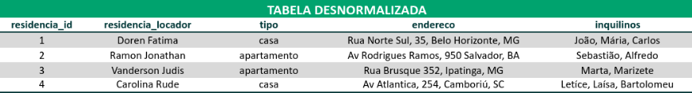
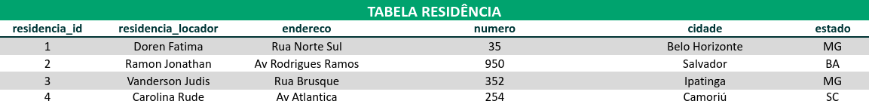
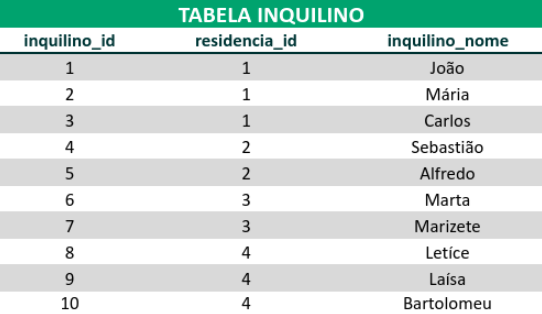
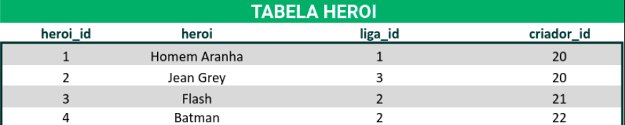
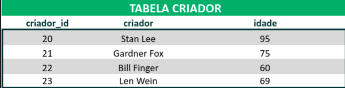
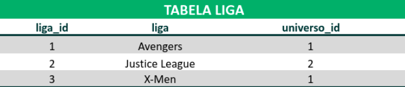
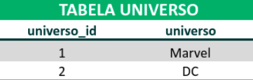
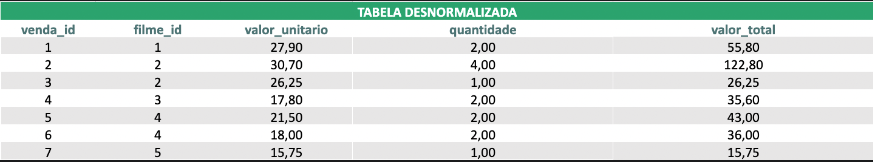
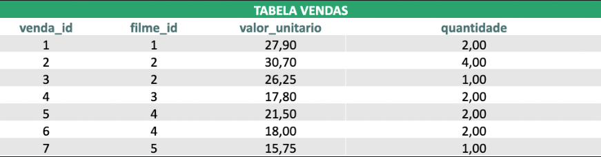

-- Exercicios: 

-- 1. 🚀 Um zoológico precisa de um banco de dados para armazenar informações sobre os seus animais. As informações a serem armazenadas sobre cada animal são:

-- * Nome;

-- * Espécie;

-- * Sexo;

-- * Idade;

-- * Localização.

Cada animal também possui vários cuidadores, e cada cuidador pode ser responsável por mais de um animal. Além disso, cada cuidador possui um gerente, sendo que cada gerente pode ser responsável por mais de um cuidador;
```js
-- * Crie o banco de dados usando os comandos DROP SCHEMA IF EXISTS, CREATE e USE para derrubar um banco de dados de mesmo nome caso ele já exista, recria-lo e garantir que este banco de dados seja o banco que receberá os comandos a seguir: 

DROP SCHEMA IF EXISTS zoologico;
CREATE SCHEMA zoologico;
USE zoologico;


-- * Crie a tabela de animais: 
CREATE TABLE animal(
    animal_id INT PRIMARY KEY AUTO_INCREMENT,
    nome VARCHAR(50) NOT NULL,
    especie VARCHAR(50) NOT NULL,
    sexo VARCHAR(50) NOT NULL,
    idade INT NOT NULL,
    localizacao VARCHAR(50) NOT NULL
);

-- * Crie a tabela de gerentes: 
CREATE TABLE gerente(
    gerente_id INT PRIMARY KEY AUTO_INCREMENT,
    nome VARCHAR(50) NOT NULL
);

-- * Crie a tabela de cuidador relacionando cada cuidador a seu gerente usando uma chave estrangeira (foreign key): 
CREATE TABLE cuidador(
    cuidador_id INT PRIMARY KEY AUTO_INCREMENT,
    nome VARCHAR(50) NOT NULL,
    gerente_id INT NOT NULL,
    FOREIGN KEY (gerente_id) REFERENCES gerente (gerente_id)
);

-- * Crie a tabela de relação entre os animais e seus cuidadores: 
CREATE TABLE animal_cuidador(
    animal_id INT,
    cuidador_id INT,
    CONSTRAINT PRIMARY KEY(animal_id, cuidador_id),
    FOREIGN KEY (animal_id) REFERENCES animal (animal_id),
    FOREIGN KEY (cuidador_id) REFERENCES cuidador (cuidador_id)
);
```
-- Consulte as imagens associadas aos exercícios como referência para resolução;

-- Não é necessário montar queries para resolver os exercícios. Crie novas planilhas com suas respostas;

-- 2. 🚀 Converta a tabela desnormalizada abaixo para a 1ª Forma Normal;


# Solução:




-- 3. 🚀 Converta a tabela desnormalizada abaixo (que já está nos padrões da 1ª Forma Normal) para a 2ª Forma Normal;


-- Solução:






-- 4. 🚀 Agora, converta essa outra tabela (que já está nos moldes das duas primeiras formas) para a 3ª Forma Normal;


-- Solução:


-- * Na 3FN temos que eliminar aquelas colunas que podem ser obtidas por alguma fórmula de outras colunas da mesma tabela. Os valores da coluna valor_total podiam ser obtidos pela multiplicação dos valores das colunas valor_unitario e quantidade.