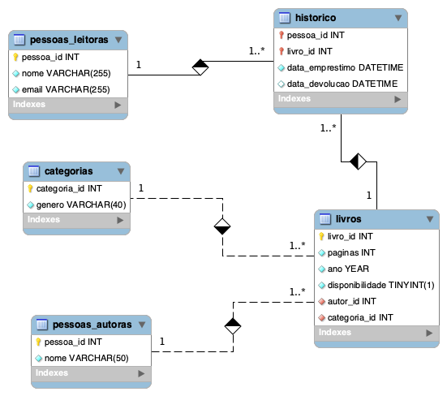

```js
DROP DATABASE IF EXISTS biblioteca;

CREATE DATABASE IF NOT EXISTS biblioteca;

USE biblioteca;

-- tabela pessoas autoras com pessoa_id, nome

CREATE TABLE pessoas_autoras (
  pessoa_id INT NOT NULL PRIMARY KEY AUTO_INCREMENT,
  nome VARCHAR(50) NOT NULL
);

-- tabela categorias com categoria_id, genero

CREATE TABLE categorias (
  categoria_id INT NOT NULL PRIMARY KEY AUTO_INCREMENT,
  genero VARCHAR(40) NOT NULL
);

-- tabela pessoas_leitoras com pessoa_id, nome e email

CREATE TABLE pessoas_leitoras (
  pessoa_id INT NOT NULL PRIMARY KEY AUTO_INCREMENT,
  nome  VARCHAR(255) NOT NULL,
  email VARCHAR(255) NOT NULL UNIQUE
);

-- tabela livros com livro_id titulo, paginas
-- ano, disponibilidade
-- pessoa_id, categoria_id

CREATE TABLE livros (
  livro_id INT NOT NULL PRIMARY KEY AUTO_INCREMENT,
  paginas INT NOT NULL,
  ano YEAR NOT NULL,
  disponibilidade BOOL NOT NULL DEFAULT TRUE,
  autor_id INT NOT NULL,
  categoria_id INT NOT NULL,
  FOREIGN KEY (autor_id) REFERENCES pessoas_autoras(pessoa_id),
  FOREIGN KEY (categoria_id) REFERENCES categorias(categoria_id)
);


-- tabela historico com data_emprestimo,
-- data_devolucao
-- N:N Livros e Pessoas leitoras

CREATE TABLE historico (
  pessoa_id INT NOT NULL,
  livro_id INT NOT NULL,
  data_emprestimo DATETIME NOT NULL DEFAULT CURRENT_TIMESTAMP,
  data_devolucao DATETIME,
  FOREIGN KEY (pessoa_id) REFERENCES pessoas_leitoras (pessoa_id),
  FOREIGN KEY (livro_id) REFERENCES livros(livro_id),
  CONSTRAINT PRIMARY KEY (pessoa_id, livro_id)
);
```

